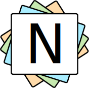

<!-- PROJECT LOGO -->

<qoute>Markdown :bookmark_tabs: note taking app using React.js and Python.<qoute>

<!-- Project images -->

---

<!-- Table of content -->

## Table of Contents

- [Requirements](#requirements)
- [Local Installation](#local-installation)
- [Docker Installation](#docker-installation)
- [Features](#features)
- [Contributing](#contributing)
- [FAQ](#faq)
- [Support](#support)
- [To Do List](#todo-list)
- [License](#license)

---

<!-- Requirements -->

## Requirements

- Node.js >= 11.9.0
- Python >= 3.7

---

<!-- Local Installation -->

## Local installation

### Clone :dancers:

Clone this repo to your local machine using `git clone https://github.com/yeyeto2788/NoteDown`

### Setup :toolbox:

- Install Python requirements. :computer:

  ```shell
  cd ./NoteDown/python_api
  pip install -r requirements
  ```

- Install Nodejs requirements :electron:

  ```shell
  cd ../react_app
  npm install
  npm run build
  npm run postbuild
  ```

- Serve the application using python :snake:
  ```shell
  cd ..
  cd ./python_api
  python run.py
  ```

---

## Docker installation

- Build the images :cd:

  ```shell
  docker build --tag notedown_app_image -f notedown_app.dockerfile --build-args REACT_APP_NOTEDOWN_API_URL=http://127.0.0.1:5000.
  docker build --tag notedown_api_image -f notedown_api.dockerfile --build-args NOTEDOWN_DB_URL=<url_of_your_db> .
  ```

  For database URL on the API you need to follow the syntax described [here](https://docs.sqlalchemy.org/en/13/core/engines.html#database-urls).

- Run the container :package:

  ```shell
  docker run -p 80:80 -d --name notedown-app notedown_app_image
  docker run -p 5000:8080 -d --name notedown-api notedown_api_image
  ```

- Inspect the container :mag:
  ```shell
  docker exec -it notedown-app /bin/bash
  ```

## docker-compose installation

- Execute this one and only command.

```shell
docker-compose up --force-recreate --build
```

---

<!-- Features -->

## Features :sparkles:

- Markdown syntax for the notes. :bookmark_tabs:
- JWT for authentication :lock:
- Print your notes. :printer: (Not yet implemented :worried:)

---

<!-- Frequently asked questions -->

## FAQ :raising_hand_woman::raising_hand_man:

No frequently asked question yet. :neutral_face:

---

<!-- Support -->

## Support :mechanic:

Reach out to me at one of the following places!

- Website at [juanbiondi.com](https://www.juanbiondi.com) (Work In Progess)
- Create an [issue](https://github.com/yeyeto2788/NoteDown/issues/new/choose) on this repository. :pirate_flag:
- Send me an [email](mailto:jebp.freelance@gmail.com) :email:

---

<!-- Things to do -->

## ToDo list

- **API**
  - ~~Require tokens on all endpoints except for the login and the register ones~~. :heavy_check_mark:
  - ~~Move logic into controllers separate.~~ :heavy_check_mark:
  - Add logout endpoint.
  - Create a token blacklist.
  - Create test for the logic on the controllers and/or `utils` module.
  - Adopt PostgreSQL as the main database and maybe have SQLite as backup?
- **FE**
  - ~~Create the login component.~~ :heavy_check_mark:
  - ~~Use token for request.~~ :heavy_check_mark:
  - Login/Register screen.
  - Authenticate users.
  - Add logout call to the API.
  - Better refresh on NoteList component.
    - Add note.
    - Edit note.
  - Create tests for the components.
  - Add logo and ~~icon on the page~~.:heavy_check_mark:
  - Generate a common error page component that could be reusable for any error that might occur while using the application.
  - Print option for the note.
- **Deployment**
  - ~~Finalize `Dockerfile`~~ :heavy_check_mark: and/or ~~move it to `docker-compose.yml` so every component can be deployed separately (DB, FE, BE)~~ :heavy_check_mark:.
  - Create some tools that might help on deployment and CI/CD pipelines.
- **General**
  - ~~Generate simple logo for the application.~~ :heavy_check_mark:
  - Gather some screenshots.
  - ~~Improve this `README`.~~ :heavy_check_mark:

---

<!-- Contributing -->

## Contributing

Contributions are what make the open source community such an amazing place to be learn, inspire, and create. Any contributions you make are **greatly appreciated**.

1. Fork the Project
2. Create your Feature Branch (`git checkout -b feature/super_awesome_feature`)
3. Commit your Changes (`git commit -m 'Add some awesome feature'`)
4. Push to the Branch (`git push origin feature/super_awesome_feature`)
5. Open a Pull Request

---

<!-- License -->

## License

See [**`LICENSE`**](./LICENSE) for more information.
